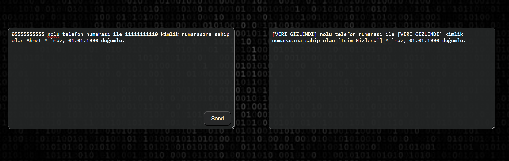

# NER Model with SpaCy

This project aims to develop a Named Entity Recognition (NER) model using SpaCy. Follow the steps below to run the project and train the model. Note that this model is being developed for the Turkish language and is based on the tr_core_news_trf model ( https://github.com/turkish-nlp-suite/turkish-spacy-models ).

## Requirements

This project uses Python 3.11.9. All necessary Python packages are listed in the requirements.txt file.

## Installation

First, install the required packages by running: pip install -r requirements.txt

## Data Files

The project contains the following data files:
1. new_data.py
2. new_test_data.py
3. old_data.py
4. old_test_data.py

These files contain the data needed for training the model. You can add the desired data to these files. Note that the data (e.g., phone numbers and identity numbers) are randomly generated and do not have any real meaning.

## USAGE

1. **Data Conversion:**
    To convert the data to SpaCy format, run the create_spacy_data.py file:  
    - python create_spacy_data.py

    This step will convert the data into a format that SpaCy can understand.

2. **Model Training**
    To start training the model, run the following command:

    - python -m spacy train config.cfg --output ./ --paths.train ./train.spacy --paths.dev ./test.spacy

    This command will train the model using the configuration in config.cfg and save the results to the this directory.

## SECURITY NOTE
    This application is designed for educational purposes and doesn't include encryption. Do not use it to transmit sensitive information in an untrusted environment.

